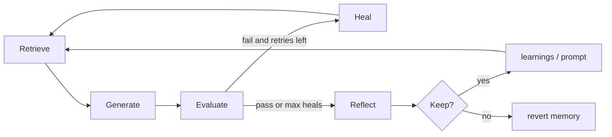

# ParcelCo Flywheel — concept (one loop)

**Build with us:** [WORKSHOP.md](WORKSHOP.md)

## What we are doing

We are building a **self-improving support agent** as **one realtime loop**:

```text
retrieve → generate → evaluate → heal? → reflect (suite) → keep/revert
```

A frozen local LLM (Qwen) answers ParcelCo tickets. A Python checklist grades replies. If a reply fails, the **same loop** retries (heal). When we run the loop across many tickets, **reflect** writes lessons and a **gate** keeps them only if scores improve.

The suite gate is implemented by the CLI `improve` command. The dashboard's
single-ticket/autonomous reflection path writes sanitized learn-set lessons
immediately without a holdout evaluation; measure suite scores separately before
claiming improvement from that path.

**ParcelCo** is fictional. The product is the visible loop + proof.

## What we are not doing

- Not fine-tuning Qwen (Workshop 2 later)
- Not “two separate systems” (heal vs improve) — one loop, different steps
- Not LLM self-grading — checklist is the gate

## The one loop



| Step | What happens |
|------|----------------|
| **Retrieve** | Pull policy/FAQ for this ticket |
| **Generate** | Qwen drafts reply + `ACTION:` |
| **Evaluate** | Checklist vs expected JSON |
| **Heal** | Feed errors back; retry (bounded) |
| **Reflect** | On the suite: lessons from learn-set failures |
| **Gate** | Keep only if learn-set rises and holdout holds |

**Learn set** (Part A) = tickets we learn from.  
**Holdout** (Part B) = score only — proves we didn’t memorize.

Catalog today: **700** learn-set + **300** holdout (**1000** total); live `--suite demo` uses core **35**.

## How the room sees it

1. **Pick a ticket** from the big list  
2. **Run loop on ticket** — watch nodes light in realtime + attempt timeline  
3. **Score suite** — where it was  
4. **Learn** — reflect + gate — where it is now  
5. Optional **LangFuse** trace for the generate step  

Punchline:

> One loop. Act, check, heal, reflect, keep only when the numbers say so. Weights stay frozen.
