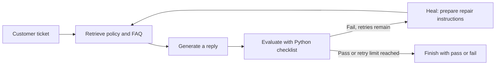
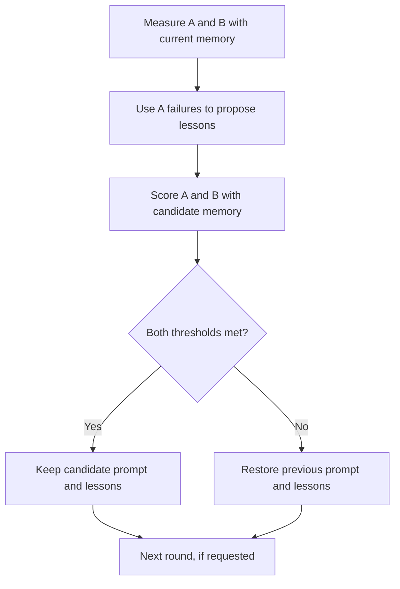

# How the agent checks and changes its work

[Visual guide](index.html#loop) · [Try the exercises](WORKSHOP.md)

A customer asks ParcelCo for help. The agent reads the policy, writes a reply, and runs a checklist. If the reply fails, it can try again with specific feedback. Some runs also save lessons that become instructions for future replies.

**Self-improvement here means changing prompt text or saved lessons. The model's weights do not change.**

## First, handle one ticket



With the default `PARCELCO_MAX_HEAL=2`, there are at most **three drafts**: the first attempt and two retries. Reaching the limit can still end in failure; it does not automatically change the action to `escalate`.

The checklist compares against `expected/{ticket_id}.json`. It checks the action, required phrases, alternatives in phrase groups, forbidden phrases, and some internal jargon. Phrase matching is case-insensitive and based on substrings. The evaluator is Python, not an LLM judging its own reply.

## Then, decide what to remember

Two entry points reuse that ticket workflow but handle memory differently:

| Dashboard action | What changes? | Does the suite gate run? |
|---|---|---|
| **Run this ticket**, learn set | After a failed or repaired reply, a template may append a filtered lesson immediately. A clean first-attempt pass saves nothing. | **No.** “KEEP” here means the lesson was saved. |
| **Run this ticket**, holdout | Scores and retries the reply; does not write a lesson. | No. |
| **Score suite** | Runs both sets using current memory and logs results. Prompt and lessons stay fixed. | No proposed change to test. |
| **Learn + keep/revert** | Measures a starting score, proposes lessons from learn-set failures, adds a prompt reminder if needed, and re-scores both sets. | **Yes.** Keeps or restores prompt and lessons. |

Single-ticket reflection uses templates. Batch reflection asks the chat model to summarize failure patterns, with a text fallback if that call fails. A text filter removes some undesirable lesson lines; it is not a guarantee that a lesson is correct.

## The batch keep/revert rule



By default, keep a candidate only when:

```text
candidate A ≥ last accepted A + 0.05
candidate B ≥ last accepted B − 0.05
```

`0.05` means **five percentage points**, not a five-percent relative increase. For example, 60% → 65% is a five-point gain. The reference updates after an accepted round; “last accepted” does not mean the highest B score ever seen. Small allowed drops can accumulate across accepted rounds.

Each suite pass rate is **tickets passing every check ÷ tickets evaluated**, after retries. It is not the average of the per-reply `score` field. Round history includes rejected candidates, so read the **kept/reverted** label before calling a chart point an improvement.

## Learn set and holdout

| Suite | A: learn (`improve`) | B: holdout (`holdout`) |
|---|---:|---:|
| Demo: `tier=core` | 28 | 19 |
| Full catalog | 700 | 300 |

A supplies the failures used to write durable lessons. B is excluded from that lesson-writing step and is used in the batch acceptance decision.

There are limits to what these scores tell us:

- **Retries use expected answers**, including on holdout tickets: the repair brief can reveal the correct action and missing phrases. These are scores for a label-assisted workflow, not independent first-attempt accuracy.
- The checklist can miss bad reasoning and reject reasonable paraphrases. It does not fully measure support quality.
- B participates in repeated selection, so it acts as a validation set. It does not prove the absence of memorization. A separate untouched test set would be needed for a stronger evaluation.
- The full catalog includes synthetic variations. More tickets do not automatically mean broader coverage.
- A saved lesson may make later replies worse. The single-ticket path does not test that; the batch path only checks the configured thresholds.

## Words you will hear

| Term | Meaning in this repo |
|---|---|
| Agent | The reply-writing model together with its retrieval, checks, retries, and memory. |
| Harness | The code that runs that workflow around the model. |
| RAG | Retrieval-augmented generation: put relevant policy text into the request before generating. |
| Embeddings | Numeric representations of text used for similarity search. Keyword retrieval is the fallback here. |
| Heal | Retry the current ticket with a prior draft and explicit repair instructions. |
| Reflect | Turn failure signals into a lesson for later tickets. |
| Gate | The batch rule that accepts or rejects a proposed memory change. |
| Trace | A record of model calls and scores, optionally stored in Langfuse. |

[Code map](../IMPLEMENT_FOR_QWEN.md) links each term to its implementation.
